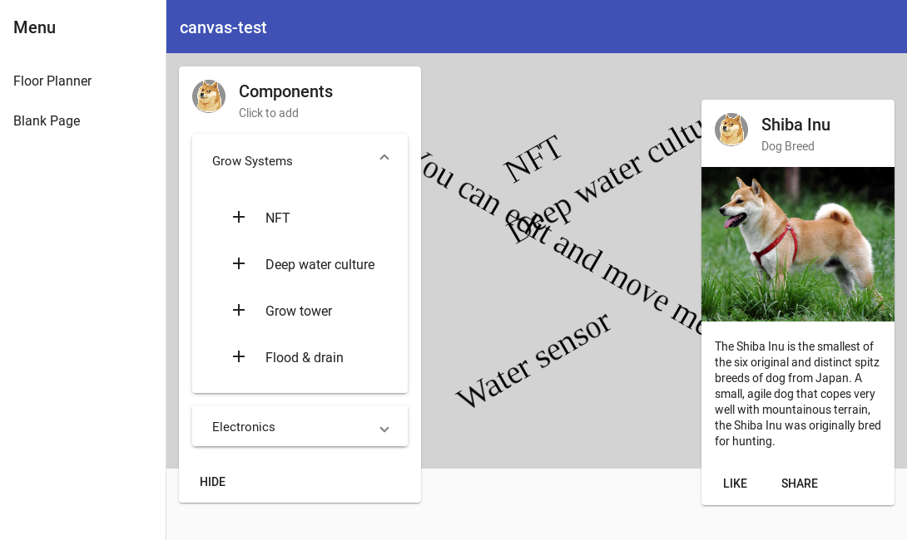

# CanvasTest

Test creating a canvas with **fabric.js** and hovering **Material** cards over it. The test also
shows how to resize the canvas on window resizes and setting its initial size. It is reactive!

Clicking on a list item now adds it to the canvas as a text item.

The next steps include

- Add SVG representations of the components (instead of text)
- Add constraints to the obejcts (water pumps have to be attached to water pipes)
- Serialization of the plan
- Create simulations based on the plan (power use, expected crop yield)

Inspired by kevoj's [angular-editor-fabric-js app](https://github.com/kevoj/angular-editor-fabric-js)

## Open Issues

- Zooming and panning require a bit of code
- Decide whether to scale vertically as well
- Interactive buttons: Material buttons that modify the canvas

## Development server

Run `ng serve` for a dev server. Navigate to `http://localhost:4200/`. The app will automatically
reload if you change any of the source files.
